# Ansible Runner Role 🚀

Complete role to execute command or script pipelines with multiple phases:

* 🔹 **Pre-run**: commands executed before the main action
* 🏃 **Run Action**: main commands or script execution
* 🛠️ **Post-run**: cleanup or final tasks

## Key Features

| Feature | Description | Emoji |
| --- | --- | --- |
| Pre-run | Executes tasks before the main action | 🔹 |
| Run Action | Main pipeline tasks | 🏃 |
| Post-run | Final cleanup tasks | 🛠️ |
| Confirmation | Allows user confirmation before running | ✅ |
| Auto-retry | Allows re-executing failed commands N times | 🔁 |
| Timeout | Limits execution time for each command | ⏱️ |
| Parallel execution | Run commands asynchronously/in parallel | ⚡ |
| Docker | Support for executing commands inside containers | 🐳 |
| Logs | Captures output in files and JSON | 📄 |
| Ignore errors | Continues even if the command fails | ❌ |

---

## Playbook Structure

Example `main.yml` to test the role:

```yaml
- name: Runner-v2 Role Test
  hosts: localhost
  gather_facts: yes

  vars:
    pre_run:
      - type: bash
        path: scripts/check_env.sh
        name: "Check Linux environment"
        ask_confirmation: false
      - type: powershell
        path: scripts/check_env.psh
        name: "Check Windows environment"
        ask_confirmation: false

    run_action:
      - type: python3
        path: scripts/deploy.py
        name: "Deploy Python"
        ask_confirmation: true
        confirmation_message: "Do you want to execute the Python deploy? (yes/no)"
        retries: 2
        ignore_errors: false
      - type: powershell
        path: scripts/deploy.psh
        name: "Deploy PowerShell"
        ask_confirmation: true
        confirmation_message: "Do you want to execute the PowerShell deploy? (yes/no)"
        retries: 2
        ignore_errors: false
      - type: bash
        path: scripts/migrate.sh
        name: "DB Migration"
        ask_confirmation: true
        confirmation_message: "Do you want to execute the migration? (yes/no)"
        retries: 1
        ignore_errors: false

    post_run:
      - type: powershell
        path: scripts/cleanup.ps1
        name: "Windows Cleanup"
        ask_confirmation: false
      - type: bash
        path: scripts/migrate.sh
        name: "Linux Cleanup"
        ask_confirmation: false

  roles:
    - runner-v2

```

---

## Callback Configuration for Better Formatting

To view logs in YAML format, configure `ansible.cfg`:

```ini
[defaults]
# Use the YAML callback plugin
stdout_callback = yaml
# Enable callback for ad-hoc commands
bin_ansible_callbacks = True

```

---

## How the Role Execution Works

1. **Pre-run**
Executes pre-check scripts before the main pipeline.
2. **Run Action**
Executes main scripts or commands.
* Asks the user if execution should continue (if `ask_confirmation` = true).
* Allows automatic retries (`retries`) if the command fails.
* Can ignore errors (`ignore_errors`) without interrupting the pipeline.


3. **Post-run**
Executes cleanup scripts or final tasks after the pipeline.
4. **Logs**
Each command generates a `.log` file inside `runner_config.tmp_dir` with:

```text
RETURN_CODE: 0
STDOUT:
...
STDERR:
...

```

5. **PowerShell**
Checks if PowerShell (`pwsh`) is installed and automatically installs it on Ubuntu via Snap if necessary.
6. **Docker**
Commands of type `docker` are executed inside containers in an isolated manner.

---

## **Roadmap – runner-v2** 🚀

### **Short Term (Quick delivery / Immediate impact)** 🟢

These are **high value, low complexity** features, ideal for validating the runner foundation:

| Feature | Justification / Value | Emoji | Complexity |
| --- | --- | --- | --- |
| Local offline execution | Create a Go binary to run locally without directly depending on Ansible, abstracting the fact that it runs Ansible (since the only reason to use Ansible is for Zuul). Allows quick testing and development without network dependency or Ansible knowledge. Example: `zuul-runner main.yml` <- runs the described pipeline. | 🖥️ | 2 |
| Dry-run Mode | Simulates execution without altering anything, ideal for validation and security. | 🕵️‍♂️ | 2 |
| Visual alerts in terminal | Facilitates log interpretation and improves productivity. | 🎨 | 1 |
| Pre-checks and validations | Prevents unnecessary failures and increases reliability. **Example**: checking for existence of files and directories, URL access, etc. | ✅ | 2 |
| CI/CD Integration | Allows triggering the runner in existing pipelines, calling it from a repository independent of Zuul and ensuring immediate usage. | 🔗 | 2 |

---

### **Medium Term (Strategic impact / Moderate complexity)** 🟡

Features that add **security, flexibility, and traceability**:

| Feature | Justification / Value | Emoji | Complexity |
| --- | --- | --- | --- |
| Conditional Pipeline | Smart flows based on previous results, reducing rework and increasing efficiency. | 🔀 | 3 |
| Dynamic Templates | Reuse and parameterization of scripts, reducing errors and duplication. | 📝 | 3 |
| Vault Integration | Enhanced security, avoiding hardcoded credentials. | 🔐 | 3 |
| Full Audit | Guaranteed traceability and compliance. | 📊 | 3 |
| Multi-OS Support | Greater compatibility and flexibility for execution on different systems. | 🌐 | 3 |
| Centralized Logs | Facilitates analysis and auditing of executions. | 🗃️ | 3 |
| Script Versioning | Guarantees consistency across different versions of scripts or roles. | 🗂️ | 3 |
| Dynamic Parameters per Pipeline | Customization by branch, workflow, or environment, increasing flexibility. | ⚙️ | 3 |
| Multiple Workflows per Repo Support | Facilitated organization and maintenance in complex projects. | 🔄 | 3 |

---

### **Long Term (High value / High complexity)** 🔴

Features that demand **advanced integration, automation, and parallelism**, but will bring major impact on performance and reliability:

| Feature | Justification / Value | Emoji | Complexity |
| --- | --- | --- | --- |
| Execution via Zuul w/ remote repo | Centralized updates and cross-team collaboration, allowing workflows to run directly from remote repositories. | 🔄 | 4 |
| Automatic Rollback | Reduces risk in production environments by automatically reverting changes upon failure. | ⏪ | 5 |
| Advanced Parallelism | Reduces total execution time while maintaining dependencies between tasks. | ⚡ | 4 |
| Kubernetes Support | Integration with cloud-native clusters, essential for modern pipelines. | ☸️ | 4 |
| Checkpoint / Resume | Resumes partial executions after failures, avoiding rework in long pipelines. | ⏩ | 4 |
| Multiple Repository Support | Combining files from different repositories, essential for distributed environments or microservices. | 🔄 | 4 |
| Performance Metrics | Allows monitoring and optimization of pipelines based on time and resource consumption. | ⏱️ | 3 |

## Runner v2 Workflow

```mermaid
flowchart TD
    %% Node Styles
    classDef startEnd fill:#DDEEFF,stroke:#333,stroke-width:2px;
    classDef process fill:#E0FFD8,stroke:#333,stroke-width:1.5px;
    classDef decision fill:#FFF2CC,stroke:#333,stroke-width:2px;
    classDef feature fill:#FFDDE0,stroke:#333,stroke-width:1px;
    classDef log fill:#F0E6FF,stroke:#333,stroke-width:1px;

    %% Main Flow
    A[Start Execution]:::startEnd --> B[Pre-checks & Validations]:::process
    B --> C{Clone Remote Repo? 🔄}:::decision
    C -- Yes --> D[Select repo workflow: .zuul-runner/workflow.yml]:::process
    C -- No --> E[Use local workflow]:::process
    D --> F[Inject dynamic parameters & variables ⚙️📝]:::process
    E --> F
    F --> G[Execute main pipeline]:::process

    %% Grouped Pipeline Features
    subgraph PIPELINE[Pipeline Features 🚀]
        direction TB
        G1[Conditional Pipeline 🔀]:::feature
        G2[Advanced Parallelism ⚡]:::feature
        G3[Kubernetes Support ☸️]:::feature
        G4[Vault Integration 🔐]:::feature
        G5[Dynamic Templates 📝]:::feature
        G6[Dry-run Mode 🕵️‍♂️]:::feature
        G7[Automatic Rollback ⏪]:::feature
        G8[Checkpoint / Resume ⏩]:::feature
        G9[Multi-OS Support 🌐]:::feature
        G10[Script Versioning 🗂️]:::feature
    end

    G --> PIPELINE
    PIPELINE --> H[Logs & Audit 📊🎨]:::log
    H --> I[Performance Metrics ⏱️]:::log
    I --> J[End]:::startEnd

```


